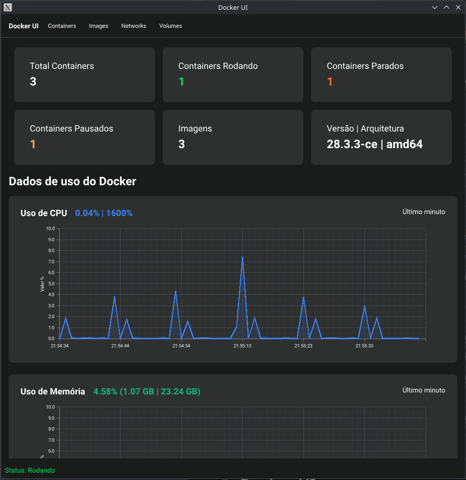
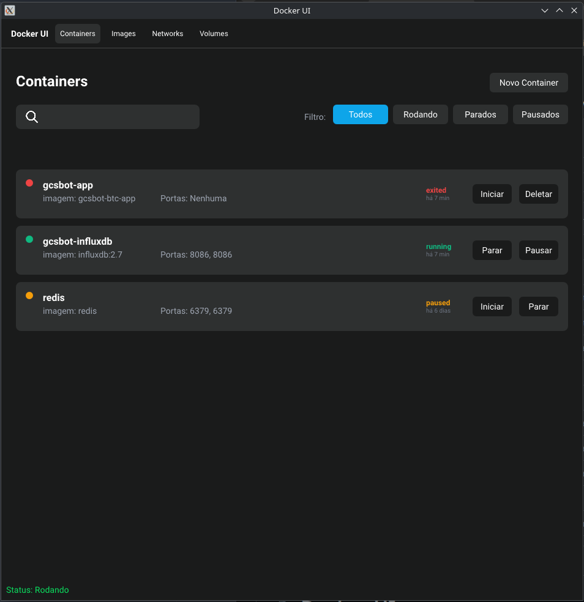
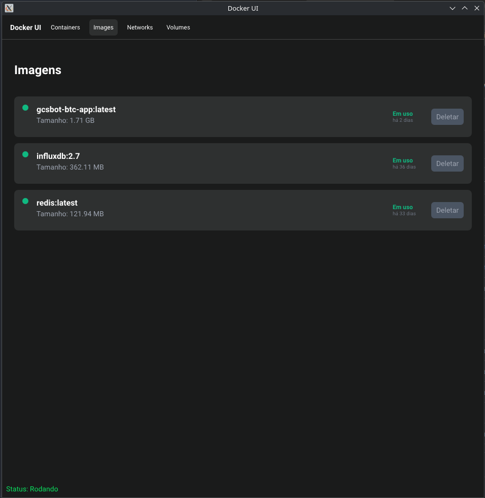
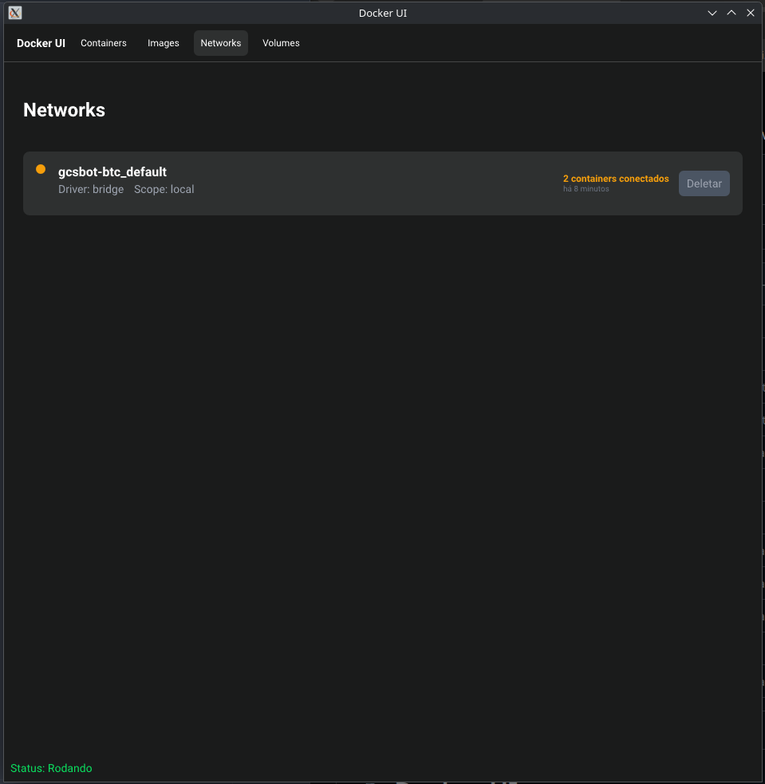
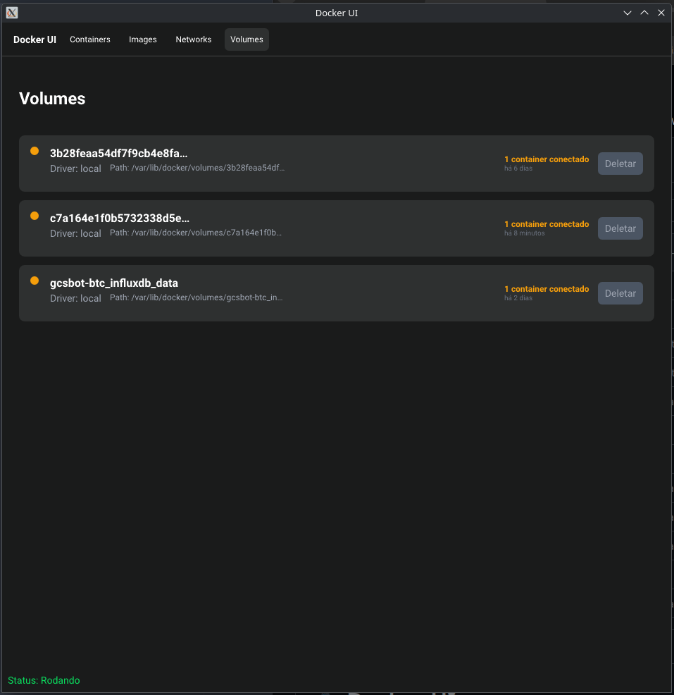

#  Docker UI

Uma aplicação de monitoramento Docker construída com Rust e Slint, oferecendo uma interface gráfica moderna para visualizar estatísticas e gerenciar containers.

<p align="center">
  
  
  
  
</p>

## 📸 Screenshots

<p align="center">
  
  <br>
  <em>Dashboard principal com estatísticas em tempo real</em>
</p>

### 🖼️ Galeria Completa de Interface

<table>
  <tr>
    <td align="center">
      
      <br><strong>📊 Dashboard</strong>
      <br><em>Monitoramento em tempo real</em>
    </td>
    <td align="center">
      
      <br><strong>🐳 Containers</strong>
      <br><em>Gerenciamento completo</em>
    </td>
    <td align="center">
      
      <br><strong>🖼️ Images</strong>
      <br><em>Controle de imagens Docker</em>
    </td>
  </tr>
  <tr>
    <td align="center">
      
      <br><strong>🌐 Networks</strong>
      <br><em>Redes personalizadas</em>
    </td>
    <td align="center">
      
      <br><strong>💾 Volumes</strong>
      <br><em>Armazenamento persistente</em>
    </td>
    <td align="center">
      <div style="height: 200px; display: flex; align-items: center; justify-content: center; background: #f8f9fa; border: 2px dashed #dee2e6; border-radius: 8px;">
        <span style="color: #6c757d; font-size: 14px;">Interface Completa</span>
      </div>
      <br><strong>✨ Funcionalidades</strong>
      <br><em>Todas as telas em uma UI</em>
    </td>
  </tr>
</table>

## ✨ Funcionalidades

### 📊 **Dashboard & Monitoramento**
- **Dashboard em tempo real** - CPU, memória e rede com gráficos interativos
- **Gráficos históricos** - Últimos 60 pontos de dados atualizados a cada segundo
- **Status do Docker** - Verificação automática do daemon e informações do sistema

### 🐳 **Gerenciamento de Containers**
- **Lista completa** - Todos os containers (rodando, parados, pausados)
- **Controles avançados** - Start, stop, pause, unpause, remove
- **Busca e filtros** - Por nome, status (all/running/stopped/paused)
- **Atualização em tempo real** - Lista atualizada automaticamente

### 🖼️ **Gerenciamento de Imagens**
- **Lista de imagens** - Com tags, tamanho e tempo de criação
- **Status de uso** - Indica se imagem está sendo usada por containers
- **Remoção segura** - Impede exclusão de imagens em uso
- **Ordenação consistente** - Lista mantém ordem alfabética

### 🌐 **Gerenciamento de Networks**
- **Networks personalizadas** - Exclui networks de sistema (bridge, host, none)
- **Contagem de containers** - Mostra quantos containers estão conectados
- **Proteção inteligente** - Impede remoção de networks em uso
- **Indicadores visuais** - Verde (disponível) / Amarelo (em uso)

### 💾 **Gerenciamento de Volumes**
- **Volumes ativos** - Mostra apenas volumes com containers conectados
- **Path completo** - Exibe mountpoint com truncagem inteligente
- **Proteção de dados** - Impede remoção de volumes em uso
- **Driver e metadata** - Informações detalhadas de cada volume

### ⚡ **Funcionalidades Avançadas**
- **Interface modular** - Componentes separados e reutilizáveis
- **Mensagens temporárias** - Feedback com auto-dismiss em 3 segundos
- **Ordenação consistente** - Listas mantêm ordem entre atualizações
- **Performance otimizada** - Renderização eficiente com Slint
- **Arquitetura limpa** - Separação UI/lógica com padrões consistentes

## 🚀 Pré-requisitos

- **Rust** 1.70+ 
- **Docker** instalado e rodando

### Dependências por sistema

#### Ubuntu/Debian:
```bash
sudo apt update
sudo apt install build-essential pkg-config libfontconfig1-dev
```

#### openSUSE:
```bash
sudo zypper refresh
sudo zypper install gcc gcc-c++ pkg-config fontconfig-devel rpm-build
```

#### Instalação automática:
```bash
make deps  # Detecta o sistema automaticamente
```

## 📦 Instalação

1. **Clone o repositório:**
   ```bash
   git clone <url-do-repositorio>
   cd teste-docker
   ```

2. **Compile e execute:**
   ```bash
   # Usando Cargo diretamente
   cargo run
   
   # Ou usando Makefile
   make dev
   ```

## 📦 Build e Distribuição

### Build rápido para desenvolvimento
```bash
make build          # Build release
make dev            # Run em modo desenvolvimento
make watch          # Run com auto-reload
```

### Geração de pacotes

#### Para sistemas Debian/Ubuntu (.deb)
```bash
# Gerar pacote .deb versionado
./build-deb.sh
# ou
make deb

# Build completo (check, test, build, package)
make release
```

#### Para openSUSE (.rpm)
```bash
# Gerar pacote .rpm versionado
./build-rpm.sh
# ou
make rpm

# Build completo para openSUSE (check, test, build, rpm)
make release-rpm
```

### Gerenciamento de builds
```bash
# Listar todos os builds
make list-builds

# Limpar builds antigos (manter 5 mais recentes)
make clean-builds

# Limpar todos os builds
make clean-all-builds
```

### Instalação local

#### Para sistemas Debian/Ubuntu
```bash
# Instalar pacote .deb localmente
make install

# Desinstalar
make uninstall

# Reinstalar
make reinstall
```

#### Para openSUSE
```bash
# Instalar pacote .rpm localmente
make install-rpm

# Desinstalar
make uninstall

# Reinstalar
make reinstall-rpm

# Instalação manual
sudo rpm -ivh builds/docker-ui-*.rpm

# Desinstalação manual
sudo rpm -e docker-ui
```

## 🛠️ Desenvolvimento

### Modo watch (recompilação automática)
```bash
# Instalar cargo-watch
cargo install cargo-watch

# Executar em modo watch
cargo watch -x run

# Watch com limpeza de tela
cargo watch -c -x run
```

### Desenvolvimento de UI
A interface utiliza **imports modulares** do Slint:
```slint
import { DashboardView } from "dashboard.slint";
import { ContainersList } from "containers.slint";
import { ImagesList } from "images.slint";
// ...
```

Cada componente é independente e reutilizável, facilitando manutenção e desenvolvimento.

### Estrutura do projeto
```
├── src/
│   ├── main.rs          # Aplicação principal e gerenciamento de estado
│   ├── docker.rs        # API Docker e coleta de estatísticas
│   ├── chart.rs         # Renderização de gráficos
│   └── build.rs         # Script de compilação Slint
├── ui/
│   ├── app.slint        # Interface principal e janela
│   ├── dashboard.slint  # Dashboard com estatísticas
│   ├── containers.slint # Tela de containers
│   ├── container.slint  # Componentes individuais de container
│   ├── images.slint     # Tela de imagens Docker
│   ├── network.slint    # Tela de redes
│   └── volumes.slint    # Tela de volumes
├── assets/
│   └── *.png            # Ícones da aplicação (múltiplos tamanhos)
├── images/
│   └── *.png            # Screenshots da aplicação
├── builds/              # Pacotes .deb gerados (criado automaticamente)
├── build-deb.sh         # Script de build versionado
├── clean-builds.sh      # Script de limpeza de builds
├── Makefile             # Sistema de build automatizado
└── Cargo.toml           # Dependências do projeto
```

## 🎯 Como usar

1. **Execute a aplicação:**
   ```bash
   cargo run
   ```

2. **Navegue pelas abas:**
   - **Docker UI**: Dashboard principal com estatísticas em tempo real
   - **Containers**: Gerenciamento completo (start/stop/pause/remove)
   - **Images**: Visualização e remoção de imagens Docker
   - **Networks**: Gerenciamento de redes personalizadas
   - **Volumes**: Gerenciamento de volumes ativos

3. **Funcionalidades principais:**
   - **Monitoramento**: Gráficos atualizados a cada segundo
   - **Controle**: Ações em containers, imagens, networks e volumes
   - **Proteção**: Impede remoção de recursos em uso
   - **Feedback**: Mensagens de sucesso/erro com auto-dismiss
   - **Consistência**: Listas mantêm ordem alfabética

## 🏗️ Arquitetura

### Visão Geral da Arquitetura

A aplicação Docker UI segue uma **arquitetura modular em camadas** que separa claramente as responsabilidades entre interface, lógica de negócio e integração com Docker. O design permite escalabilidade, manutenibilidade e suporte tanto a instâncias Docker locais quanto remotas via SSH.

```
┌─────────────────────────────────────────────────────────────────┐
│                     CAMADA DE APRESENTAÇÃO                     │
├─────────────────────────────────────────────────────────────────┤
│  UI Components (Slint)  │  State Management  │  Event Handlers │
│  • app.slint           │  • AppState        │  • Timer callbacks│
│  • dashboard.slint     │  • ChartData       │  • UI callbacks  │
│  • containers.slint    │  • UI Managers     │  • User actions  │
│  • images.slint        │                    │                  │
│  • networks.slint      │                    │                  │
│  • volumes.slint       │                    │                  │
└─────────────────────────────────────────────────────────────────┘
                                    │
                                    ▼
┌─────────────────────────────────────────────────────────────────┐
│                    CAMADA DE LÓGICA DE NEGÓCIO                 │
├─────────────────────────────────────────────────────────────────┤
│  Resource Managers      │  Chart Rendering   │  Configuration   │
│  • ContainerUIManager  │  • ChartRenderer   │  • Config        │
│  • ImageUIManager      │  • ChartPoint      │  • SshConfig     │
│  • NetworkUIManager    │  • PlottersBackend │                  │
│  • VolumeUIManager     │                    │                  │
└─────────────────────────────────────────────────────────────────┘
                                    │
                                    ▼
┌─────────────────────────────────────────────────────────────────┐
│                    CAMADA DE INTEGRAÇÃO                        │
├─────────────────────────────────────────────────────────────────┤
│  Docker Interface      │  Remote Management │  SSH Connectivity│
│  • DockerManager      │  • RemoteServerMgr │  • SshConnection  │
│  • DockerInfo         │  • DockerRemoteAdp │  • SshDockerClient│
│  • Local Docker API   │  • ServerInfo      │  • AuthMethods    │
└─────────────────────────────────────────────────────────────────┘
                                    │
                                    ▼
┌─────────────────────────────────────────────────────────────────┐
│                    CAMADA DE INFRAESTRUTURA                    │
├─────────────────────────────────────────────────────────────────┤
│  Docker Engine         │  SSH Servers       │  Local System    │
│  • Local Docker        │  • Remote Docker   │  • File System   │
│  • Container Runtime   │  • SSH Protocol    │  • Networking    │
│  • Image Registry      │  • Authentication  │  • Process Mgmt  │
└─────────────────────────────────────────────────────────────────┘
```

### Detalhamento das Camadas

#### 🎨 **Camada de Apresentação**
**Framework**: Slint UI Toolkit
**Responsabilidades**: Interface gráfica, interação do usuário, visualização de dados

**Componentes Principais**:
- **`app.slint`** - Janela principal, navegação entre telas, layout global
- **`dashboard.slint`** - Dashboard com estatísticas em tempo real e gráficos
- **`containers.slint`** - Lista de containers, controles de operação
- **`container-details.slint`** - Visualização detalhada de containers individuais
- **`create-container.slint`** - Modal para criação de novos containers
- **`images.slint`** - Gerenciamento de imagens Docker
- **`networks.slint`** - Configuração e visualização de redes
- **`volumes.slint`** - Gerenciamento de volumes persistentes
- **`servers.slint`** - Interface para gerenciamento de servidores remotos
- **`ssh_config.slint`** - Configuração de conexões SSH
- **`notification.slint`** - Sistema de notificações temporárias

**Padrões de Design**:
- **Component-Based Architecture**: Cada tela é um componente reutilizável
- **Reactive UI**: Atualizações automáticas via bindings bidirecionais
- **Modular Imports**: Sistema de imports para reutilização de componentes

#### ⚙️ **Camada de Lógica de Negócio**
**Linguagem**: Rust
**Responsabilidades**: Processamento de dados, regras de negócio, gerenciamento de estado

**Módulos Principais**:

**`main.rs`** - Orquestração central da aplicação:
- Gerenciamento do estado global (`AppState`)
- Configuração de timers para atualizações em tempo real
- Coordenação entre UI e serviços backend
- Lifecycle management da aplicação

**Resource Managers** - Gerenciadores especializados por tipo de recurso:
- **`list_containers.rs`** (`ContainerUIManager`) - Lógica de containers
- **`list_images.rs`** (`ImageUIManager`) - Lógica de imagens
- **`list_networks.rs`** (`NetworkUIManager`) - Lógica de redes
- **`list_volumes.rs`** (`VolumeUIManager`) - Lógica de volumes

**`chart.rs`** (`ChartRenderer`) - Sistema de renderização de gráficos:
- Conversão de dados temporais para formato visual
- Integração com biblioteca Plotters
- Geração de gráficos SVG para UI Slint
- Otimização de performance para atualizações em tempo real

**Características**:
- **Separation of Concerns**: Cada manager é responsável por um tipo específico de recurso
- **Thread-Safe**: Uso de `Arc<Mutex<>>` para compartilhamento seguro de estado
- **Error Handling**: Tratamento robusto de erros com tipo `Result<T, E>`

#### 🔌 **Camada de Integração**
**Responsabilidades**: Abstração de APIs externas, conectividade, adaptação de protocolos

**Docker Integration**:
**`docker.rs`** (`DockerManager`) - Interface principal com Docker:
- Abstração da API Docker via biblioteca Bollard
- Coleta de estatísticas de containers em tempo real
- Operações CRUD em todos os recursos Docker
- Tratamento de erros específicos do Docker

**Remote Management**:
**`remote/`** - Sistema de gerenciamento multi-servidor:
- **`manager.rs`** (`RemoteServerManager`) - Gerenciamento centralizado de servidores
- **`docker_remote.rs`** (`DockerRemoteAdapter`) - Adapter pattern para Docker remoto
- Suporte a múltiplas instâncias Docker simultâneas
- Persistência de configurações de servidor

**SSH Connectivity**:
**`ssh/`** - Conectividade SSH para servidores remotos:
- **`config.rs`** (`SshServerConfig`) - Configuração de conexões SSH
- **`connection.rs`** (`SshConnection`) - Gerenciamento de sessões SSH
- **`client.rs`** (`SshDockerClient`) - Cliente Docker sobre SSH
- Suporte a múltiplos métodos de autenticação (senha, chave privada)

**Padrões de Design**:
- **Adapter Pattern**: Uniformização de interfaces locais/remotas
- **Factory Pattern**: Criação dinâmica de clientes Docker
- **Strategy Pattern**: Diferentes estratégias de autenticação SSH

#### 🛠️ **Camada de Infraestrutura**
**Responsabilidades**: Recursos de sistema, protocolos de rede, APIs externas

**Docker Engine**: 
- Docker daemon local ou remoto
- Container runtime (containerd/CRI-O)
- Image registry integration
- Network plugins e storage drivers

**SSH Infrastructure**:
- Protocolo SSH para comunicação remota
- Autenticação baseada em chaves/senhas
- Tunelamento seguro de comandos Docker

**System Resources**:
- File system para persistência de configurações
- Network stack para comunicação
- Process management para execução de comandos

### Fluxo de Dados e Comunicação

#### 📊 **Fluxo de Monitoramento em Tempo Real**
```
Timer (1s) → DockerManager → Statistics Collection → UI Update
     ↓              ↓                    ↓               ↓
  Slint Timer → Docker API → JSON Data → Reactive Binding
```

#### 🐳 **Fluxo de Operações em Containers**
```
User Action → UI Event → Manager → Docker API → Response → UI Update
     ↓            ↓          ↓          ↓           ↓          ↓
Click Start → callback → ContainerUIManager → bollard → Result → notification
```

#### 🌐 **Fluxo de Conexão Remota**
```
SSH Config → RemoteServerManager → DockerRemoteAdapter → SSH Client → Docker Commands
     ↓              ↓                      ↓                ↓            ↓
User Input → Server Registry → Adapter Factory → SSH Session → Remote Execution
```

### Tecnologias e Dependências

#### **Frontend**
- **[Slint 1.6](https://slint.dev/)** - Framework de UI nativo e performático
- **SVG Graphics** - Renderização de gráficos via Plotters

#### **Backend**
- **[Rust 2024 Edition](https://rust-lang.org/)** - Linguagem de programação
- **[Tokio 1.47](https://tokio.rs/)** - Runtime assíncrono
- **[Bollard 0.19](https://github.com/fussybeaver/bollard)** - Cliente Docker nativo
- **[Plotters 0.3](https://github.com/plotters-rs/plotters)** - Biblioteca de gráficos

#### **Conectividade**
- **[OpenSSH 0.10](https://github.com/openssh-rust/openssh)** - Cliente SSH de alto nível
- **[SSH2 0.9](https://github.com/alexcrichton/ssh2-rs)** - Bindings SSH de baixo nível

#### **Serialização e Utilitários**
- **[Serde 1.0](https://serde.rs/)** - Serialização/deserialização
- **[Chrono 0.4](https://github.com/chronotope/chrono)** - Manipulação de tempo
- **[UUID 1.0](https://github.com/uuid-rs/uuid)** - Geração de identificadores únicos

### Padrões Arquiteturais Implementados

#### **📦 Modular Architecture**
- Separação clara de responsabilidades por módulo
- Baixo acoplamento entre componentes
- Alta coesão dentro de cada módulo

#### **🔄 MVC-like Pattern**
- **Model**: Estruturas de dados (ContainerInfo, ImageInfo, etc.)
- **View**: Componentes Slint (.slint files)
- **Controller**: Managers (ContainerUIManager, ImageUIManager, etc.)

#### **🎭 Adapter Pattern**
- `DockerRemoteAdapter` uniformiza interface local/remoto
- Abstração transparente para o código cliente
- Facilita adição de novos tipos de servidor

#### **🏭 Factory Pattern**
- Criação dinâmica de clientes Docker baseada em configuração
- `RemoteServerManager` atua como factory para adapters
- Suporte a diferentes tipos de servidor (local/SSH)

#### **📡 Observer Pattern**
- Sistema de timers para atualizações periódicas
- UI reativa com bindings automáticos
- Notificações baseadas em eventos

### Sistema de Build e Distribuição

#### **Build System**
- **`build.rs`** - Script de compilação Slint integrado ao Cargo
- **`Makefile`** - Automação de tarefas de desenvolvimento e build
- **Multi-platform**: Suporte para diferentes distribuições Linux

#### **Packaging**
- **`build-deb.sh`** - Geração de pacotes .deb para Debian/Ubuntu
- **`build-rpm.sh`** - Geração de pacotes .rpm para openSUSE/RHEL
- **`clean-builds.sh`** - Gerenciamento automático de builds antigos

#### **Development Tools**
- **Hot Reload**: `cargo watch` para desenvolvimento iterativo
- **Dependency Management**: Detecção automática de dependências do sistema
- **Asset Management**: Ícones em múltiplos formatos e resoluções

### Escalabilidade e Extensibilidade

#### **📈 Escalabilidade**
- **Multi-server Support**: Gerenciamento simultâneo de múltiplos Docker daemons
- **Async Processing**: Operações não-bloqueantes com Tokio
- **Memory Efficient**: Estruturas de dados otimizadas e reutilização de objetos

#### **🔧 Extensibilidade**
- **Plugin Architecture**: Novos tipos de servidor podem ser adicionados facilmente
- **Modular UI**: Componentes Slint independentes e reutilizáveis
- **Configuration System**: Sistema flexível de configuração via arquivos JSON

#### **🛡️ Robustez**
- **Error Handling**: Tratamento abrangente de erros em todas as camadas
- **Connection Recovery**: Reconexão automática em caso de falhas de rede
- **Data Validation**: Validação rigorosa de entradas e configurações

## 🔧 Tecnologias

- **[Rust](https://rust-lang.org/)** - Linguagem de programação
- **[Slint](https://slint.dev/)** - Framework de interface gráfica
- **[Bollard](https://github.com/fussybeaver/bollard)** - Client Docker para Rust
- **[Plotters](https://github.com/plotters-rs/plotters)** - Biblioteca de gráficos
- **[Tokio](https://tokio.rs/)** - Runtime assíncrono

## 📊 Métricas monitoradas

- **CPU**: Porcentagem de uso em tempo real
- **Memória**: Uso e limite com porcentagem
- **Rede**: Bytes recebidos (RX) e transmitidos (TX)
- **I/O Disco**: Operações de leitura e escrita
- **Containers**: Total, rodando, parados e pausados
- **Imagens**: Quantidade total de imagens

## 🎨 Interface

A aplicação possui:
- **Tema escuro** com cores modernas
- **Cards informativos** para estatísticas principais
- **Gráficos de linha** para dados temporais
- **Status visual** com cores indicativas
- **Layout responsivo** adaptável

### 🎯 Ícones disponíveis

A aplicação inclui ícones em múltiplos tamanhos para diferentes usos:

| Tamanho | Arquivo | Uso |
|---------|---------|-----|
| 32x32   | `assets/32x32.png` | Ícone pequeno |
| 48x48   | `assets/48x48.png` | Ícone médio |
| 64x64   | `assets/64x64.png` | Ícone padrão |
| 96x96   | `assets/96x96.png` | Ícone grande |
| 128x128 | `assets/128x128.png` | Ícone HD |
| -       | `assets/icon.png` | Ícone principal |
| -       | `assets/icon.ico` | Windows |
| -       | `assets/icon.icns` | macOS |

## 🐛 Solução de problemas

### Docker não conecta
```bash
# Verificar se Docker está rodando
sudo systemctl status docker

# Iniciar Docker se necessário
sudo systemctl start docker

# Adicionar usuário ao grupo docker
sudo usermod -aG docker $USER
```

### Erro de compilação
```bash
# Limpar cache do Cargo
cargo clean

# Atualizar dependências
cargo update

# Recompilar
cargo build
```

## 🤝 Contribuindo

1. Fork o projeto
2. Crie uma branch para sua feature (`git checkout -b feature/nova-feature`)
3. Commit suas mudanças (`git commit -am 'Adiciona nova feature'`)
4. Push para a branch (`git push origin feature/nova-feature`)
5. Abra um Pull Request

## 📝 Licença

Este projeto está licenciado sob a [MIT License](LICENSE).

## 🚀 Próximas funcionalidades

- [x] **Arquitetura modular** - Componentes Slint separados ✅
- [x] **Interface responsiva** - Layout otimizado ✅
- [ ] **Gerenciamento de containers** - Start/stop/restart via UI
- [ ] **Visualização de logs** - Logs em tempo real
- [ ] **Métricas avançadas** - Histórico e exportação
- [ ] **Docker Compose** - Suporte a stacks
- [ ] **Temas personalizáveis** - Light/Dark mode
- [ ] **Configuração de alertas** - Notificações
- [ ] **Multi-host support** - Múltiplos Docker daemons

---

**Desenvolvido com ❤️ usando Rust e Slint**