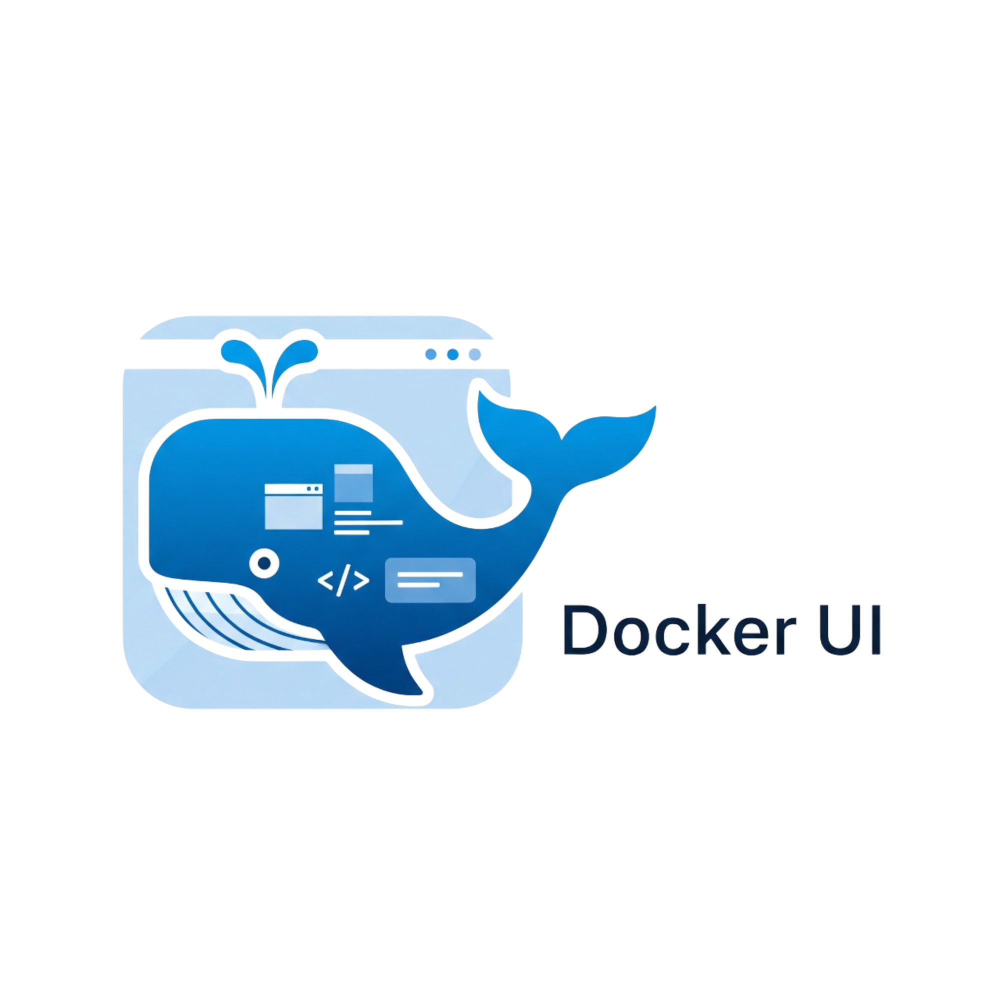

#  Docker UI

Uma aplicação de monitoramento Docker construída com Rust e Slint, oferecendo uma interface gráfica moderna para visualizar estatísticas e gerenciar containers.

<p align="center">
  
  
  
  
</p>

## 📸 Screenshots

<p align="center">
  
  <br>
  <em>Dashboard principal com estatísticas em tempo real</em>
</p>

<p align="center">
  
  <br>
  <em>Gráficos de CPU e memória em tempo real</em>
</p>

### 🖼️ Galeria de Interface

<table>
  <tr>
    <td align="center">
      
      <br><strong>Dashboard Overview</strong>
      <br><em>Cards de estatísticas e status</em>
    </td>
    <td align="center">
      
      <br><strong>Monitoramento em Tempo Real</strong>
      <br><em>Gráficos de CPU, memória e rede</em>
    </td>
  </tr>
</table>

## ✨ Funcionalidades

### 📊 **Dashboard & Monitoramento**
- **Dashboard em tempo real** - CPU, memória e rede com gráficos interativos
- **Gráficos históricos** - Últimos 60 pontos de dados atualizados a cada segundo
- **Status do Docker** - Verificação automática do daemon e informações do sistema

### 🐳 **Gerenciamento de Containers**
- **Lista completa** - Todos os containers (rodando, parados, pausados)
- **Controles avançados** - Start, stop, pause, unpause, remove
- **Busca e filtros** - Por nome, status (all/running/stopped/paused)
- **Atualização em tempo real** - Lista atualizada automaticamente

### 🖼️ **Gerenciamento de Imagens**
- **Lista de imagens** - Com tags, tamanho e tempo de criação
- **Status de uso** - Indica se imagem está sendo usada por containers
- **Remoção segura** - Impede exclusão de imagens em uso
- **Ordenação consistente** - Lista mantém ordem alfabética

### 🌐 **Gerenciamento de Networks**
- **Networks personalizadas** - Exclui networks de sistema (bridge, host, none)
- **Contagem de containers** - Mostra quantos containers estão conectados
- **Proteção inteligente** - Impede remoção de networks em uso
- **Indicadores visuais** - Verde (disponível) / Amarelo (em uso)

### 💾 **Gerenciamento de Volumes**
- **Volumes ativos** - Mostra apenas volumes com containers conectados
- **Path completo** - Exibe mountpoint com truncagem inteligente
- **Proteção de dados** - Impede remoção de volumes em uso
- **Driver e metadata** - Informações detalhadas de cada volume

### ⚡ **Funcionalidades Avançadas**
- **Interface modular** - Componentes separados e reutilizáveis
- **Mensagens temporárias** - Feedback com auto-dismiss em 3 segundos
- **Ordenação consistente** - Listas mantêm ordem entre atualizações
- **Performance otimizada** - Renderização eficiente com Slint
- **Arquitetura limpa** - Separação UI/lógica com padrões consistentes

## 🚀 Pré-requisitos

- **Rust** 1.70+ 
- **Docker** instalado e rodando
- **Dependências do sistema** (Ubuntu/Debian):
  ```bash
  sudo apt update
  sudo apt install build-essential pkg-config libfontconfig1-dev
  ```

## 📦 Instalação

1. **Clone o repositório:**
   ```bash
   git clone <url-do-repositorio>
   cd teste-docker
   ```

2. **Compile e execute:**
   ```bash
   # Usando Cargo diretamente
   cargo run
   
   # Ou usando Makefile
   make dev
   ```

## 📦 Build e Distribuição

### Build rápido para desenvolvimento
```bash
make build          # Build release
make dev            # Run em modo desenvolvimento
make watch          # Run com auto-reload
```

### Geração de pacote .deb
```bash
# Gerar pacote .deb versionado
./build-deb.sh
# ou
make deb

# Build completo (check, test, build, package)
make release
```

### Gerenciamento de builds
```bash
# Listar todos os builds
make list-builds

# Limpar builds antigos (manter 5 mais recentes)
make clean-builds

# Limpar todos os builds
make clean-all-builds
```

### Instalação local
```bash
# Instalar pacote .deb localmente
make install

# Desinstalar
make uninstall

# Reinstalar
make reinstall
```

## 🛠️ Desenvolvimento

### Modo watch (recompilação automática)
```bash
# Instalar cargo-watch
cargo install cargo-watch

# Executar em modo watch
cargo watch -x run

# Watch com limpeza de tela
cargo watch -c -x run
```

### Desenvolvimento de UI
A interface utiliza **imports modulares** do Slint:
```slint
import { DashboardView } from "dashboard.slint";
import { ContainersList } from "containers.slint";
import { ImagesList } from "images.slint";
// ...
```

Cada componente é independente e reutilizável, facilitando manutenção e desenvolvimento.

### Estrutura do projeto
```
├── src/
│   ├── main.rs          # Aplicação principal e gerenciamento de estado
│   ├── docker.rs        # API Docker e coleta de estatísticas
│   ├── chart.rs         # Renderização de gráficos
│   └── build.rs         # Script de compilação Slint
├── ui/
│   ├── app.slint        # Interface principal e janela
│   ├── dashboard.slint  # Dashboard com estatísticas
│   ├── containers.slint # Tela de containers
│   ├── container.slint  # Componentes individuais de container
│   ├── images.slint     # Tela de imagens Docker
│   ├── network.slint    # Tela de redes
│   └── volumes.slint    # Tela de volumes
├── assets/
│   └── *.png            # Ícones da aplicação (múltiplos tamanhos)
├── images/
│   └── *.png            # Screenshots da aplicação
├── builds/              # Pacotes .deb gerados (criado automaticamente)
├── build-deb.sh         # Script de build versionado
├── clean-builds.sh      # Script de limpeza de builds
├── Makefile             # Sistema de build automatizado
└── Cargo.toml           # Dependências do projeto
```

## 🎯 Como usar

1. **Execute a aplicação:**
   ```bash
   cargo run
   ```

2. **Navegue pelas abas:**
   - **Docker UI**: Dashboard principal com estatísticas em tempo real
   - **Containers**: Gerenciamento completo (start/stop/pause/remove)
   - **Images**: Visualização e remoção de imagens Docker
   - **Networks**: Gerenciamento de redes personalizadas
   - **Volumes**: Gerenciamento de volumes ativos

3. **Funcionalidades principais:**
   - **Monitoramento**: Gráficos atualizados a cada segundo
   - **Controle**: Ações em containers, imagens, networks e volumes
   - **Proteção**: Impede remoção de recursos em uso
   - **Feedback**: Mensagens de sucesso/erro com auto-dismiss
   - **Consistência**: Listas mantêm ordem alfabética

## 🏗️ Arquitetura

### Interface Modular
A aplicação utiliza uma arquitetura modular com componentes Slint separados:

- **`app.slint`** - Janela principal e navegação
- **`dashboard.slint`** - Dashboard com estatísticas e gráficos
- **`containers.slint`** - Lista e gerenciamento de containers
- **`container.slint`** - Componentes individuais de container
- **`images.slint`** - Gerenciamento de imagens Docker
- **`network.slint`** - Configuração de redes
- **`volumes.slint`** - Gerenciamento de volumes

### Backend Rust
- **`main.rs`** - Orquestração e estado da aplicação
- **`docker.rs`** - API Docker e coleta de métricas
- **`chart.rs`** - Renderização de gráficos em tempo real

### Sistema de Build
- **`build-deb.sh`** - Script de build versionado para pacotes .deb
- **`clean-builds.sh`** - Gerenciamento e limpeza de builds antigos
- **`Makefile`** - Automação completa do processo de build
- **`builds/`** - Diretório de saída para pacotes gerados

## 🔧 Tecnologias

- **[Rust](https://rust-lang.org/)** - Linguagem de programação
- **[Slint](https://slint.dev/)** - Framework de interface gráfica
- **[Bollard](https://github.com/fussybeaver/bollard)** - Client Docker para Rust
- **[Plotters](https://github.com/plotters-rs/plotters)** - Biblioteca de gráficos
- **[Tokio](https://tokio.rs/)** - Runtime assíncrono

## 📊 Métricas monitoradas

- **CPU**: Porcentagem de uso em tempo real
- **Memória**: Uso e limite com porcentagem
- **Rede**: Bytes recebidos (RX) e transmitidos (TX)
- **I/O Disco**: Operações de leitura e escrita
- **Containers**: Total, rodando, parados e pausados
- **Imagens**: Quantidade total de imagens

## 🎨 Interface

A aplicação possui:
- **Tema escuro** com cores modernas
- **Cards informativos** para estatísticas principais
- **Gráficos de linha** para dados temporais
- **Status visual** com cores indicativas
- **Layout responsivo** adaptável

### 🎯 Ícones disponíveis

A aplicação inclui ícones em múltiplos tamanhos para diferentes usos:

| Tamanho | Arquivo | Uso |
|---------|---------|-----|
| 32x32   | `assets/32x32.png` | Ícone pequeno |
| 48x48   | `assets/48x48.png` | Ícone médio |
| 64x64   | `assets/64x64.png` | Ícone padrão |
| 96x96   | `assets/96x96.png` | Ícone grande |
| 128x128 | `assets/128x128.png` | Ícone HD |
| -       | `assets/icon.png` | Ícone principal |
| -       | `assets/icon.ico` | Windows |
| -       | `assets/icon.icns` | macOS |

## 🐛 Solução de problemas

### Docker não conecta
```bash
# Verificar se Docker está rodando
sudo systemctl status docker

# Iniciar Docker se necessário
sudo systemctl start docker

# Adicionar usuário ao grupo docker
sudo usermod -aG docker $USER
```

### Erro de compilação
```bash
# Limpar cache do Cargo
cargo clean

# Atualizar dependências
cargo update

# Recompilar
cargo build
```

## 🤝 Contribuindo

1. Fork o projeto
2. Crie uma branch para sua feature (`git checkout -b feature/nova-feature`)
3. Commit suas mudanças (`git commit -am 'Adiciona nova feature'`)
4. Push para a branch (`git push origin feature/nova-feature`)
5. Abra um Pull Request

## 📝 Licença

Este projeto está licenciado sob a [MIT License](LICENSE).

## 🚀 Próximas funcionalidades

- [x] **Arquitetura modular** - Componentes Slint separados ✅
- [x] **Interface responsiva** - Layout otimizado ✅
- [ ] **Gerenciamento de containers** - Start/stop/restart via UI
- [ ] **Visualização de logs** - Logs em tempo real
- [ ] **Métricas avançadas** - Histórico e exportação
- [ ] **Docker Compose** - Suporte a stacks
- [ ] **Temas personalizáveis** - Light/Dark mode
- [ ] **Configuração de alertas** - Notificações
- [ ] **Multi-host support** - Múltiplos Docker daemons

---

**Desenvolvido com ❤️ usando Rust e Slint**